# Boston Licensing Board Minutes

> **Automating the extraction, transformation, and visualization of Boston Licensing Board meeting minutes for civic transparency and data access.**

This project provides an end-to-end pipeline for collecting, processing, and analyzing licensing data from the City of Boston Licensing Board. It transforms unstructured PDF meeting minutes into searchable, structured data and presents it through an interactive dashboard.

## 🎯 Project Vision

The Boston Licensing Board oversees critical decisions about alcohol licenses, entertainment permits, and business regulations across the city. However, this information is locked away in hundreds of PDF documents scattered across the web. This project democratizes access to that data by:

- **Automating data collection** from the Boston Licensing Board website
- **Extracting structured information** from unstructured legal documents
- **Providing accessible visualizations** to explore licensing trends and decisions

The extracted data supports:
- Community advocacy groups tracking neighborhood licensing patterns
- Researchers analyzing alcohol license distribution across Boston
- Business owners understanding the licensing landscape
- Civic technologists building transparency tools

## 🏗️ Architecture Overview

The project consists of three interconnected components that form a data processing pipeline:

```mermaid
graph LR
    Web["🌐 Boston Licensing<br/>Board Website"] --> Scrape["📥 Scrape<br/>(PDFs + Videos)"]
    Scrape --> Transform["⚙️ Transform<br/>(PDF → JSON)"]
    Transform --> Dashboard["📊 Dashboard<br/>(Streamlit App)"]
    
    Scrape -.-> PDFs["voting_minutes_pdfs/"]
    Transform -.-> JSON["licenses.json"]
    Transform -.-> Excel["licenses.xlsx"]
    Dashboard -.-> Excel
    
    style Scrape fill:#e1f5ff
    style Transform fill:#fff4e1
    style Dashboard fill:#f0e1ff
```



### 1. [Scrape](./scrape) - Data Collection

A robust, modular web scraper that:
- Collects voting minutes PDFs from the Boston Licensing Board website
- Filters out video links and non-PDF content
- Validates and deduplicates downloaded files using content hashing
- Handles edge cases like Google Drive redirects and broken links

**Key Features:**
- Pipeline-based architecture for modularity and testability
- Automatic retry and error handling
- GitHub Actions automation for scheduled runs
- Comprehensive logging and statistics

See [scrape/README.md](./scrape/README.md) for detailed documentation.

### 2. [Transform](./transform) - Data Extraction

A high-performance extraction pipeline that converts PDFs into structured JSON:
- Extracts text from PDF voting minutes
- Identifies and segments individual license entries
- Parses structured fields (business name, address, license type, status, etc.)
- Validates data quality and generates completeness reports

**Key Features:**
- Chain of Responsibility pattern for granular field extraction
- Pluggable "invariant" system for date-specific parsing fixes
- Deterministic regex-based extraction (no AI/API dependencies)
- Built-in quality reporting and debugging tools

See [transform/README.md](./transform/README.md) for detailed documentation.

### 3. [Dashboard](./dashboard) - Data Visualization

An interactive Streamlit dashboard for exploring licensing data:
- **Business Search**: Look up licenses by business name or license number
- **License Analytics**: Visualize licensing trends by zipcode, meeting date, and alcohol type
- **Targeted Analysis**: Compare licensing patterns in specific Boston neighborhoods
- **Data Export**: Download the complete dataset as Excel

**Key Features:**
- Real-time filtering and search
- Interactive charts and metrics
- Mobile-friendly responsive design
- Bulk lookup capabilities

> **Note:** The dashboard README is planned for future development.

## 🚀 Quick Start

### Prerequisites

- **Python 3.13+**
- **uv** (recommended for dependency management)

### 1. Clone the Repository

```bash
git clone https://github.com/Code-for-Boston/Licensing-Board-Minutes.git
cd Licensing-Board-Minutes
```

### 2. Run the Pipeline

Each component can be run independently:

```bash
# Step 1: Scrape PDFs from the web
cd scrape
./dev_setup.sh
make run

# Step 2: Transform PDFs to JSON
cd ../transform
./dev_setup.sh
make run

# Step 3: Launch the dashboard
cd ../dashboard
uv venv
source .venv/bin/activate  # On Windows: .venv\Scripts\activate
uv pip install -e .
streamlit run app.py
```

## 📁 Project Structure

```
Licensing-Board-Minutes/
├── scrape/              # Web scraper for collecting PDFs
│   ├── app/            # Pipeline steps and business logic
│   └── scraper_state/  # Persistent state (exclude lists, video links)
│
├── transform/          # PDF to JSON extraction pipeline
│   ├── app/           # Extraction steps and processors
│   └── all_licenses.json  # Output: structured license data
│
├── dashboard/         # Streamlit visualization app
│   └── app.py        # Main dashboard application
│
└── data/             # Shared data directory
    ├── licenses.json      # Latest extracted license data
    ├── licenses.xlsx      # Excel export for analysis
    └── voting_minutes_pdfs/  # Raw PDF files
```

## 📊 Data Flow

1. **Scrape** collects PDFs from the web → saves to `data/voting_minutes_pdfs/`
2. **Transform** processes PDFs → outputs `transform/all_licenses.json`
3. **Transform** also generates → `data/licenses.xlsx` for the dashboard
4. **Dashboard** reads `data/licenses.xlsx` → displays interactive visualizations

## 🛠️ Development

Each component has its own:
- Virtual environment (`.venv/`)
- Dependencies (`pyproject.toml` + `uv.lock`)
- Makefile for common operations
- README with detailed documentation

## 📝 Data Schema

The extracted license data includes:

| Field | Description | Example |
|:------|:------------|:--------|
| `minutes_date` | Meeting date | `2024-12-15` |
| `business_name` | Legal business name | `ABC Restaurant Inc.` |
| `dba_name` | "Doing Business As" name | `The Local Tavern` |
| `license_number` | License identifier | `LB-123456` |
| `address` | Business location | `123 Main St, Boston, MA` |
| `zipcode` | 5-digit ZIP code | `02118` |
| `alcohol_type` | License category | `All Alcohol` |
| `status` | License status | `Granted`, `Denied`, `Active` |
| `manager` | Manager name(s) | `John Doe` |
| `attorney` | Attorney name(s) | `Jane Smith, Esq.` |

## 🤝 Contributing

This project is inspired from a [Code for Boston](https://www.codeforboston.org/) project. 
The details of that project are [here](https://github.com/codeforboston/boston-liquor-license-tracker).

### Areas for Contribution

- **Data Quality**: Improving extraction accuracy for edge cases
- **Visualization**: Adding new dashboard features and charts
- **Automation**: Enhancing the scraping pipeline and scheduling
- **Documentation**: Expanding guides and tutorials

## 📄 License

This project is open source and available under the MIT License.

## 🙏 Acknowledgments

- **Code for Boston** - Civic tech volunteer organization
- **City of Boston** - Source of public licensing data

---
