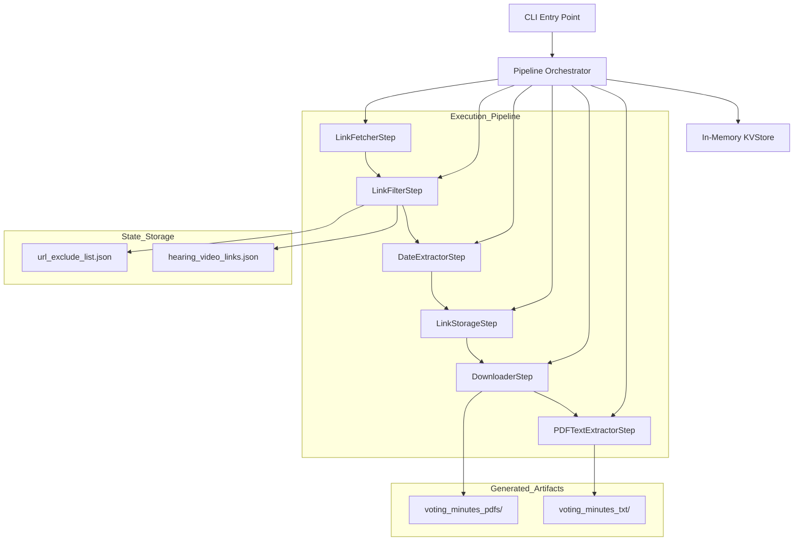

# Licensing Board Scraper

A robust, modular Python application that scrapes video links and voting minutes from the Boston Licensing Board website. It features a pipeline-based architecture for content downloading, PDF validation, text extraction, and deduplication.

See the [Scraper Design Rationale](./docs/Scraper_Design_Rational.md) for an explanation of the design decisions behind this approach.

## 🏗️ Architecture: The Pipeline Pattern

The project utilizes a **Pipeline (Chain of Responsibility) architecture** to ensure maximum modularity, testability, and separation of concerns.

### ⚙️ Pipeline Flow

The execution is managed by a `Pipeline` orchestrator that runs discrete steps. State is maintained throughout the run in a centralized `KVStore`.

1.  **LinkFetcherStep**: Scrapes the target HTML and extracts initial links.
2.  **LinkFilterStep**: Applies filters (ClientSide, Video, ExcludeList) to isolate meeting minutes.
3.  **DateExtractorStep**: Parses dates from link text and metadata.
4.  **LinkStorageStep**: Persists metadata (like video links) to the state.
5.  **DownloaderStep**: Retrieves and validates PDFs, handling Google Drive redirects and hashing for deduplication.
6.  **PDFTextExtractorStep**: (Optional) Converts PDFs to plain text.



### 🧩 Key Components

*   **`Pipeline`**: Manages the sequential execution of steps and handles the `RunResult` (proceed/halt) from each step.
*   **`KVStore`**: A JSON-compatible in-memory store that allows data to flow between steps without tight coupling.
*   **`DownloaderStep`**: Handles file retrieval with built-in deduplication via hashing. It skips files if their content hasn't changed.
*   **`PDFStore`**: Manages the local versioning of PDFs, ensuring no data is overwritten if content updates.

## 🚀 Setup & Installation

### Prerequisites

*   **Python 3.13+**
*   **uv** (Optional, but recommended for fast dependency management)

### Quick Start

```bash
# Setup environment
./dev_setup.sh

# Run with default settings
make run
```

## 🏃 Usage (CLI)

The application features a flexible CLI for configuring output directories.

```bash
# Run the scraper with default paths
uv run python -m app.cli

# Custom output directories
uv run python -m app.cli --pdf-dir custom_pdfs --txt-dir custom_txt

# Skip text extraction (omit --txt-dir)
uv run python -m app.cli --pdf-dir storage/pdfs
```

### CLI Arguments

| Argument | Description | Default |
| :--- | :--- | :--- |
| `--pdf-dir` | Directory to save downloaded PDFs | `voting_minutes_pdfs` |
| `--txt-dir` | Directory to save extracted text | (Optional - skips if omitted) |

## 📁 Project Structure & State

### Persistent State (`scraper_state/`)

*   `url_exclude_list.json`: URLs flagged as invalid PDFs or explicitly excluded.
*   `hearing_video_links.json`: Collection of extracted YouTube/video links.
*   `exception_pdfs/`: A dedicated directory for PDFs that cannot be automatically downloaded (e.g., due to complex redirects, broken direct links, or bot protection). Files placed here manually are automatically retrieved and processed by the pipeline during execution.

### Artifacts

*   `voting_minutes_pdfs/`: The versioned, deduplicated meeting minutes.
*   `voting_minutes_txt/`: Raw text extracted from the PDFs for downstream analysis.
*   `log/app.log`: Comprehensive execution logs including link statistics.
